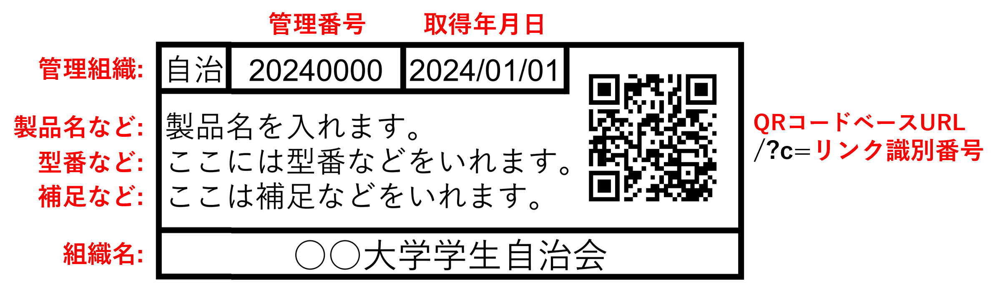

# Label Maker

備品管理ラベルを生成する

## 必須パッケージ
`reportlab`
`pyqrcode`
`openpyxl`
`shutil`

## 使い方
1. `setting.xlsx`を開く
2. `設定`シートを開き、`用紙サイズ`、`QRコードベースURL`、`組織名`を設定する。
3. `ラベル`シートを開き、それぞれの項目を入力する。
4. `main.py`を引数なしで実行する。
5. `label.pdf`が生成される。  

## 製作者
Sou Tamura([tmsou0209](https://github.com/tmsou0209))

## ライセンス
MITライセンス